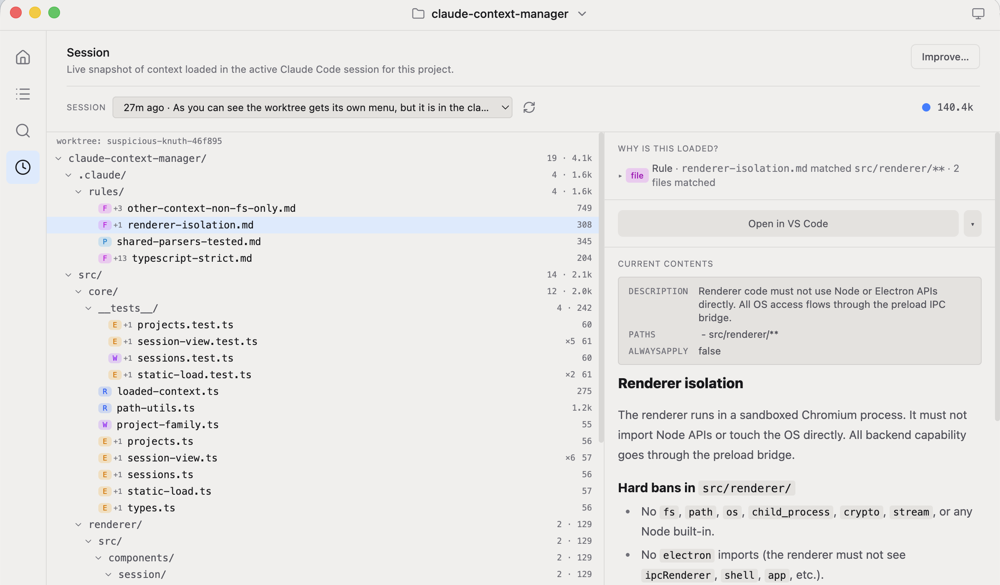

# Claude Context Manager

**See what context Claude Code is actually loading — and curate it.**

A desktop app that makes the context Claude Code already consumes visible, auditable, and curatable. It's a passive, read-only reader over your filesystem — no runtime coupling with Claude Code, no changes to your config, no network dependencies.



> Community-driven and open source. This is an early project and **collaborators are welcome** — issues, ideas, and PRs all help. If you've tried it, I'd genuinely like to hear what you think.

## Why this exists

AI-assisted coding breaks down when Claude lacks context. The code is easy; the business knowledge, team vocabulary, and past architectural decisions are not. Claude Code spreads that context across a scattered set of mechanisms — `CLAUDE.md` files at global/project/folder scope, path-scoped rules in `.claude/rules/`, lazy-loaded skills, auto-memory, MCP server configs, settings. Each solves part of the problem. Together, they're opaque.

This tool answers the questions that stack makes hard:

- **What context is loaded right now** for this project?
- **How many tokens** does each source cost?
- **Which file — which line —** is shaping a given decision?
- **What am I missing** that I should add?

There's a fuller write-up in [docs/vision.md](docs/vision.md).

## Quickstart (recommended: run from a checkout)

Right now, running from a repo checkout is the best-supported way to use it.

Requires [Node.js](https://nodejs.org/) 18+ and [pnpm](https://pnpm.io/) 10+. If you don't have pnpm:

```sh
npm install -g pnpm
```

Then:

```sh
git clone https://github.com/code-context-manager/claude-context-manager
cd claude-context-manager
pnpm install        # postinstall also builds the bundled MCP server
pnpm dev            # run the desktop app with hot reload
```

Other commands:

```sh
pnpm build         # production build of the Electron app
pnpm preview       # preview the production build
pnpm test          # run tests
pnpm mcp:build     # rebuild the bundled MCP server
pnpm dist:mac      # package macOS artifacts
pnpm dist:win      # package a Windows installer
pnpm dist:linux    # package Linux artifacts
```

### Using it in Claude Code

The app self-registers its bundled MCP server at user scope on launch. The first time you open it (installed or via `pnpm dev`), it writes an `mcpServers["claude-context-manager"]` entry to `~/.claude.json` pointing at its bundled MCP binary. Restart Claude Code afterward and tools like `get_project_static_load`, `probe_file`, and `get_active_session` are available in every project.

The registration is idempotent — only rewritten when the path drifts (e.g. you moved the checkout or reinstalled the app).

To remove it manually:

```sh
claude mcp remove claude-context-manager -s user
```

## Prebuilt binaries

Prebuilt `.dmg` / `.exe` / `.deb` / `.AppImage` artifacts are produced by the [release workflow](.github/workflows/release.yml) and published to the [Releases page](https://github.com/code-context-manager/claude-context-manager/releases/latest). They work, but **builds are not code-signed yet** (see [Status](#status)), so direct downloads need a one-time Gatekeeper/SmartScreen bypass. Until signing is in place, the repo-checkout path above is the smoothest experience.

## Contributing

This is community-driven and open source, and still early — that means there's a lot of low-friction surface to contribute on:

- Try it on your own repos and open an issue with what was confusing or missing.
- Ideas about *what context is worth surfacing* are as valuable as code.
- PRs welcome. The codebase is small and documented; see [CLAUDE.md](CLAUDE.md) and [docs/state/facts.md](docs/state/facts.md) for how the project is structured and why.

## Status

Early and actively scaffolded — no external users yet. Known gaps / roadmap:

- **Builds are unsigned (TODO).** Apple Developer Program enrollment and Windows code signing are deferred until the project has real users. Unsigned builds trigger Gatekeeper (macOS) and SmartScreen (Windows) warnings on direct download; Homebrew/Scoop installs strip the macOS quarantine attribute. This is the main reason repo-checkout is the recommended path today.
- The Playbook surface ("what context *could* be added") exists in the codebase but is not yet reachable from the UI.

Releases are tag-driven: pushing a `v*` tag runs the [release workflow](.github/workflows/release.yml), which builds for macOS / Windows / Linux, publishes a GitHub Release, and bumps the [Homebrew tap](https://github.com/code-context-manager/homebrew-tap) and [Scoop bucket](https://github.com/code-context-manager/scoop-bucket).
