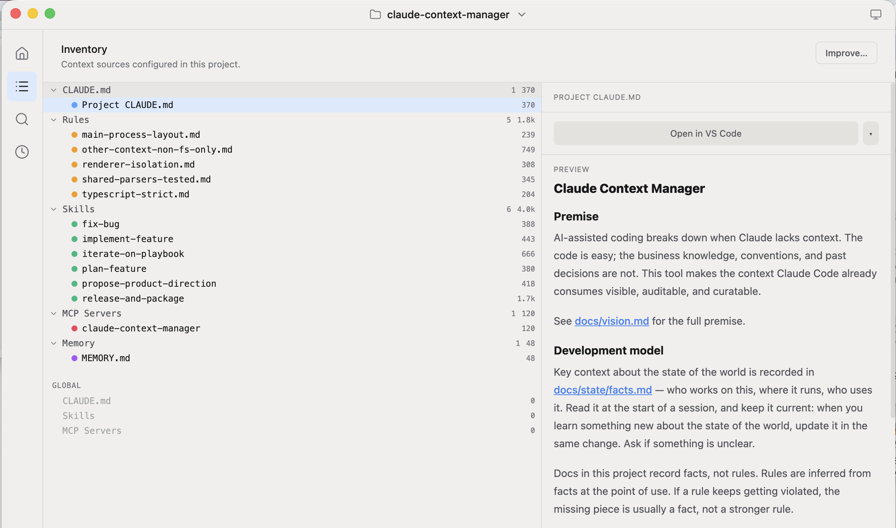
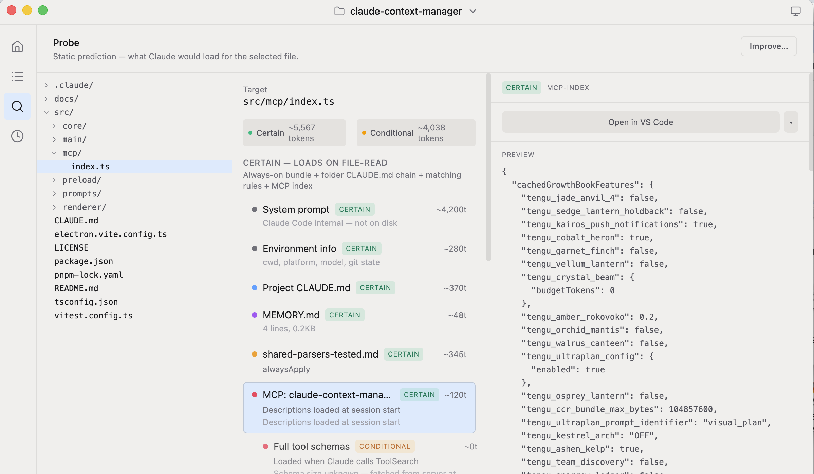

# Claude Context Manager

Claude Context Manager ships a desktop UI and a MCP server.

## Desktop UI

**Inventory** — every context source configured for the project (CLAUDE.md, rules, skills, MCP servers, memory), each with its token cost.



**Session** — a live snapshot of the context actually loaded in the active Claude Code session, read from the session transcript.


**Probe** — a static prediction of exactly what Claude would load when it reads a given file, split into *certain* vs. *conditional* tokens, traced back to the rule or file that pulls it in.



## MCP Server

The MCP server exposes the same data as shown on the UI. Use the "Improve..." buttons on the UI to copy a prompt that will access the MCP server. The Claude Context Manager MCP server gives Claude Code some self awareness into it's own setup for a specific repo.

## Quickstart (recommended: run from a checkout)

Right now, running from a repo checkout is the best-supported way to use it.

Requires [Node.js](https://nodejs.org/) 18+ and [pnpm](https://pnpm.io/) 10+. If you don't have pnpm:

```sh
npm install -g pnpm
```

Then:

```sh
git clone https://github.com/code-context-manager/claude-context-manager
cd claude-context-manager
pnpm install        # postinstall also builds the bundled MCP server
pnpm dev            # run the desktop app with hot reload
```

To remove it manually:

```sh
claude mcp remove claude-context-manager -s user
```


## Contributing

This is community-driven and open source, and still early — that means there's a lot of low-friction surface to contribute on:

- Try it on your own repos and open an issue with what was confusing or missing.
- Ideas about *what context is worth surfacing* are as valuable as code.
- PRs welcome. The codebase is small and documented; see [CLAUDE.md](CLAUDE.md) and [docs/state/facts.md](docs/state/facts.md) for how the project is structured and why.

[MIT](LICENSE).

## Prebuilt binaries

Prebuilt `.dmg` / `.exe` / `.deb` / `.AppImage` artifacts are produced by the [release workflow](.github/workflows/release.yml) and published to the [Releases page](https://github.com/code-context-manager/claude-context-manager/releases/latest). They work, but builds are not code-signed yet, so direct downloads need a one-time Gatekeeper/SmartScreen bypass — see [Status](#status) for details.
